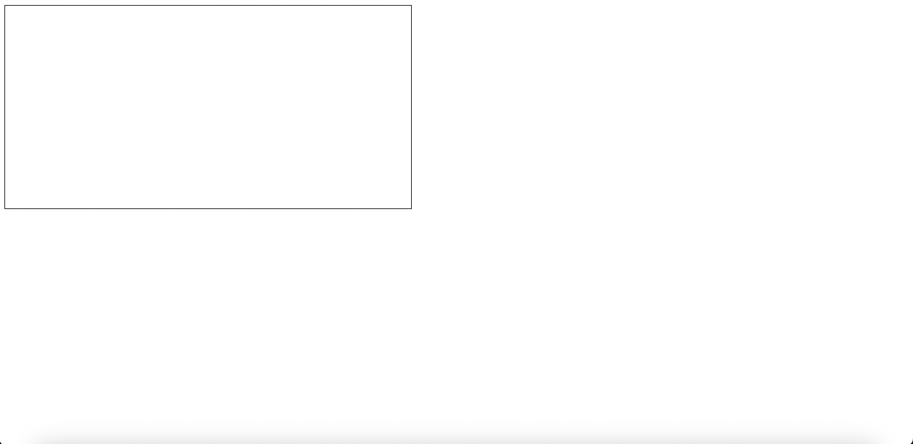

# Starting Out

Our first aim is to create the most bare-bones scaffolding we can, so that we can begin to immediately receive feedback on the code we are writing. 

I start by creating a simple `index.html` and, using emmet, create some minimal markup. 

```html
<!DOCTYPE html>
<html lang="en">

<head>
    <meta charset="UTF-8">
    <meta
        name="viewport"
        content="width=device-width, initial-scale=1.0"
    >
    <title>Chip8</title>
</head>

<body>
</body>

</html>
```

This will be the frontend for our emulator. The first thing we can add is a screen.

Since the Chip8 used a screen with a resolution of 64x32, let's take an integer scaling of that as a HTML canvas. 

```html
<body>
    <canvas
        style="border: 1px solid black"
        height="320"
        width="640"
    ></canvas>
</body>
```

Opening the web page you should see something like this:


*Not very exciting... I know*

Next, let's create two JavaScript files `index.js` and `chip8.js`. 

*chip8.js*
```javascript
const V_REG_COUNT = 16;
const STACK_SIZE = 16;
const MEMORY_SIZE = 4096;

class Chip8 {
    pc = 0;
    i = 0;
    sp = 0;
    dt = 0;
    st = 0;
    v = Array(V_REG_COUNT).fill(0);
    stack = Array(STACK_SIZE).fill(0);
    memory = Array(MEMORY_SIZE).fill(0);
}

export default Chip8;
```

*index.js*
```javascript
import Chip8 from './chip8.js';

const chip8 = new Chip8();

console.log('V4', chip8.v[0x4]);
```

and import it within our `index.html`.

```html
<head>
    <meta charset="UTF-8">
    <meta
        name="viewport"
        content="width=device-width, initial-scale=1.0"
    >
    <title>Chip8</title>

    <script
        type="module" 
        src="./index.js"></script>
</head>
```

Note! At this point you will need to be serving your index.html via a web server (I am using LiveServer inside VS Code) for it to work as expected, due to CORS. 

We will be creating our emulator within our `chip8.js` file and the script that imports the emulator and binds it's features to controls within our frontend via `index.js`. 

You should see the console message "V4 0" when opening the page now. This means success! We have the starting point of our emulator and can begin viewing details etc inside the browser. 

Now we need to begin building!