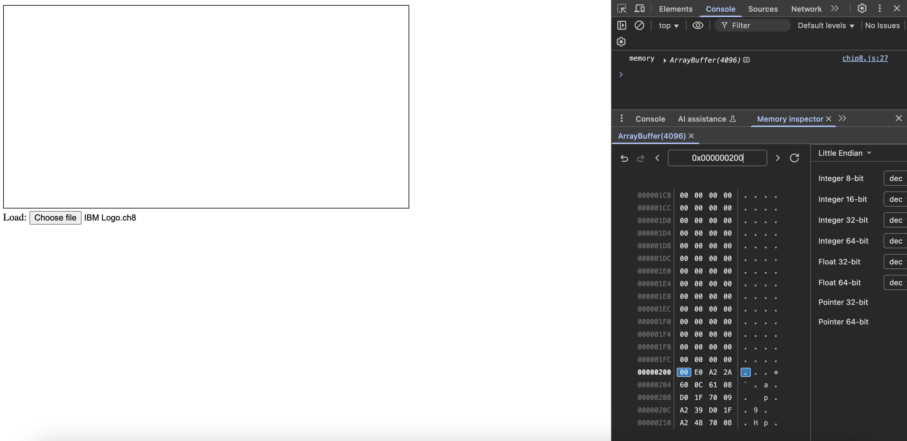

# Loading a Program

Ok, so we need to start building out the emulator. 

In Tobias' guide, he mentions that the "IBM Logo" program is a good starting program to get working, as it only uses six instructions in the cpu. 

That will be our first goal. We begin by figuring out how to get a program into memory. We need to open a file picker and retrieve the bytes of the file we select. 

We can add a file picker using the built in HTML file input.

*index.html*
```html
<body>
    <canvas
        style="border: 1px solid black"
        height="320"
        width="640"
    ></canvas>

    <div>
        <label for="load">Load:</label>
        <input
            type="file"
            id="load"
            name="load"
            accept=".ch8"
        />
    </div>

</body>
```

and then attaching an event listener to it to give us access to the underlying bytes.

*index.js*
```javascript
import Chip8 from './chip8.js';

const chip8 = new Chip8();

const filePicker = document.querySelector('#load');

async function handleFileSelection(event) {
    const file = event.target.files[0];
    const buffer = await file.arrayBuffer();
    const bytes = new Uint8Array(buffer);
    console.log('bytes', bytes);
}

filePicker.addEventListener('change', handleFileSelection);
```

You should be able to see the bytes now when you load in a chip8 program. Now that we have the bytes we just need to add a method to our Chip8 class that handles copying the bytes into memory. 

Lets add that method

```javascript
const V_REG_COUNT = 16;
const STACK_SIZE = 16;
const MEMORY_SIZE = 4096;
const PROG_START = 0x200;

class Chip8 {
    pc = 0;
    i = 0;
    sp = 0;
    dt = 0;
    st = 0;
    v = new Array(V_REG_COUNT).fill(0);
    stack = new Array(STACK_SIZE).fill(0);
    memory = new ArrayBuffer(MEMORY_SIZE);

    /**
     * Loads program into memory
     * @param {Uint8Array} bytes 
     */
    load(bytes) {
        const memory = new Uint8Array(this.memory);
        memory.set(bytes, PROG_START);
        console.log('memory', this.memory);
    }
}

export default Chip8;
```

I annotated the function with JSDoc just to keep track of they types of our arguments. 

If we hook this up to our file input button we can then verify that the bytes have been copied into our memory. 

*index.js*
```javascript
import Chip8 from './chip8.js';

const chip8 = new Chip8();

const filePicker = document.querySelector('#load');

async function handleFileSelection(event) {
    const file = event.target.files[0];
    const buffer = await file.arrayBuffer();
    const bytes = new Uint8Array(buffer);
    chip8.load(bytes);
}

filePicker.addEventListener('change', handleFileSelection);
```

Now when we load our program we should see:



So it looks like we have some bytes loaded into our internal memory! Next we have to start processing some instructions.